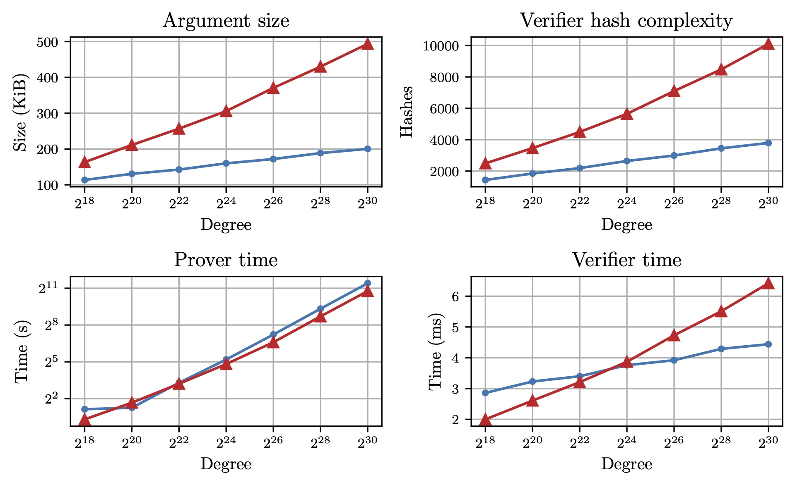

This blog-post is a short introduction to our new work: "STIR: Reed-Solomon Proximity Testing with Fewer Queries". This is joint work with Gal Arnon, Alessandro Chiesa and Eylon Yogev, and the full version is [available on ePrint](https://eprint.iacr.org/2024/XXX). Code is also available at [WizardOfMenlo/stir](https://github.com/WizardOfMenlo/stir).

Denote by $\mathsf{RS}[\mathbb{F}, \mathcal{L}, d]$ the Reed-Solomon (RS) code[^1] over the field $\mathbb{F}$ of rate $\rho = d/|\mathcal{L}|$.
Testing proximity to a RS code is the problem of, given oracle access to $f: \mathcal{L} \to \mathbb{F}$, determining whether
- $f \in \mathsf{RS}[\mathbb{F}, \mathcal{L}, d]$ i.e., $f$ is a RS codeword.
- $\Delta(f, \mathsf{RS}[\mathbb{F}, \mathcal{L}, d]) > \delta$ i.e., $f$ is $\delta$-far (in terms of Hamming distance) from any RS codeword.

In this work, we consider Interactive Oracle Proofs of Proximity (IOPP) for RS codes, i.e., interactive protocols between a prover and a verifier that aims to test proximity to a RS code in which the prover sends oracle messages.

The FRI protocol [BBHR18, BCIKS20][^fri] [^proximitygaps] is one such IOPP, and underlies many SNARK-based real-world systems which offer state-of-the-art technology that protects billions of dollars' worth of transactions in blockchains.

[^1]: Formally $\mathsf{RS}[\mathbb{F}, \mathcal{L}, d] = \\{ \hat{p}|\_\mathcal{L} : \hat{p} \in \mathbb{F}^{< d}[X] \\}$ where $\hat{p}|\_\mathcal{L}: \mathcal{L} \to \mathbb{F}$ is the restriction of $\hat{p}$ to $\mathcal{L}$.

# STIR 🥣
We present STIR (Shift To Improve Rate), a concretely efficient IOPP for RS codes that achieves the best known query complexity of any concretely efficient IOPP for this problem.

When compiled into an argument, STIR compares favourably to FRI in (i) argument size (ii) verifier time (iii) verifier hashes.

Taking $d = 2^{24}$ and $\rho = 1/2$ as an example:
- STIR arguments' have size 160 KiB compared to FRI's 306 KiB (**1.8x better**).
- STIR verifier's perform 2600 hashes compared to FRI's 5600 (**2.13x better**).
- STIR verifier's runtime is 3.8ms compared to FRI's 3.9ms (**1.03x better**).

---
## High-level overview
The core intuition behind STIR is that decreasing rate makes proximity testing easier. Intuitively, the lower the rate the more redundant the code is, and thus the verifier can make use of more structure in its testing.

Fix $k$ a "folding parameter", a proximity parameter $\delta$, and a repetition parameter $t$. 

Let $\mathcal{C} := \mathsf{RS}[\mathbb{F}, \mathcal{L}, d]$ and $\mathcal{C'} := \mathsf{RS}[\mathbb{F}, \mathcal{L}', d/k]$ with $|\mathcal{L}'| = |\mathcal{L}|/2$ be two RS codes, and let $\rho, \rho'$ be their rates.

A STIR iteration performs $t$ queries while fulfilling two roles:
1. Reduces testing proximity of $f$ to $\mathcal{C}$ to testing proximity of a new (virtual) function $f'$ to $\mathcal{C'}$.
2. Amplifies distance. Roughly, if $f$ is $\delta$-far from $\mathcal{C}$, then $f'$ is $(1 - \sqrt{\rho'})$-far[^2] from $\mathcal{C'}$ (except with probability roughly $(1 - \delta)^t$, we dub this a "bad event").

[^2]: Here and throughout, distances of the form $1 - \sqrt{\rho}$ can be improved to $1 - \rho$ by assuming a conjecture on the list-decoding of RS codes proposed in [BCIKS20,BGKS20] [^proximitygaps][^deepfri].

Testing proximity to $\mathcal{C}'$ is now easier. First, the polynomial has had its degree reduced by a factor of $k$. Second, note that $\rho' = (2/k) \cdot \rho$, so if $k > 2$ then $\rho' < \rho$, so the rate has improved.

Imagine now applying $M$ STIR iterations. Let $f_i, t_i$, $\mathcal{L}_i$ be the functions tested, repetition parameters and domains at each round. Let also $\rho_i := (2/k)^i \cdot \rho$ and $d_i = d/k^i$. At the end of those iterations, the (honest) prover will send a polynomial $\hat{p}$ of degree $d_M$. The verifier then checks at $t_M$ points of $\mathcal{L}_M$ that $f_M(x) = \hat{p}(x)$.

Let's analyse soundness of this protocol. First, we bound the probability of a bad event happening at each iteration. At the first round, this probability is $(1 - \delta)^{t_0}$. In later rounds, since the distance was amplified the probability is now:
$$ 
(1 - (1 - \sqrt{\rho_i}))^{t_i} = \rho_i^{t_i/2}
$$
If none of these bad events happen, then the polynomial $\hat{p}$ must be at distance $(1 - \sqrt{\rho_M})$ from $\mathcal{C}_M$, and so the final check will detect this with probability at least $1 - \rho_M^{t_M/2}$.

The overall soundness error of this protocol is then:
$$ 
\varepsilon \leq (1 - \delta)^{t_0} + \sum_{i = 1}^M \rho_i^{t_i/2}.
$$

Aiming each term in the above sum to be $\leq 2^{-lambda}$ so that $\varepsilon < (M+1) \cdot 2^{-\lambda}$, leads to setting $t_0 = \frac{\lambda}{- \log (1 - \delta)}$ and $t_i = \frac{\lambda}{- \log \sqrt{\rho_i}}$.

The improved rate, translates in a decrease in the values of $t_i$ (apart from the first iteration). 
This is where STIR gains its efficiency. 

In FRI, for example, the rate is _unchanged_ between iterations, so each round (apart from the first) will query its corresponding oracle at least $\frac{\lambda}{- \log \sqrt{\rho}}$ times.
In fact, since FRI does _correlated_ queries, the number of queries will be the same at each round as the first one, and at least $\max \left(\frac{\lambda}{-\log (1 - \delta)}, \frac{\lambda}{- \log \sqrt{\rho}}\right)$.
Roughly then, the total number of queries of the FRI protocol is:
$$
O\left(\lambda \cdot \left( \frac{\log d}{\log (1 - \delta)} + \frac{\log d}{-\log \sqrt{\rho}} \right)\right)
$$

STIR instead can perform only:
$$
O\left(\log d + \lambda \cdot \log \left(\frac{\log d}{\log 1/\rho}\right)\right)
$$

---
## Techniques
A STIR iteration roughly consists of the combination of two steps:

#### Folding
As in FRI, folding is the process of reducing the degree of a polynomial from $d$ to $d/k$ by decomposing it into $k$ polynomials of degree $d/k$ and taking a random combination of them.
We rely mainly on two properties of folding:
1. Folding preserves distance (except with probability at most $1 - \mathrm{poly}(|\mathcal{L}|)/\mathbb{F}$, which, assuming a large field, is very small).
2. Folding is local. Given oracle access to $f$, computing the value of the fold $f$ at a point in the folded domain is efficient (and involves querying $f$ at exactly $k$ locations).

#### Quotienting
The quotient of a function $f$ w.r.t to a function $p: S \to \mathbb{F}$ is the function of $X$ defined as:
$$ 
\frac{f(X) - \hat{p}(X)}{\prod_{a \in S} (X - a)}
$$
where $\hat{p}$ is the polynomial interpolating $p$ over $S$.
We rely on two properties of quotients:
1. If all low-degree polynomials close to $f$ disagree with $p$, then the quotient is far from the RS code.
2. Quotienting is local. Given oracle access to $f$, computing the value of the quotient at a point is efficient (and involves querying $f$ at a single location).

### The STIR iteration 

We describe, at a high level, an iteration of STIR. Let $\mathcal{L}^k = \\{ x^k : x \in \mathcal{L} \\}$.

1. **Folding-randomness**: The verifier samples and sends $\alpha \gets \mathbb{F}$.
2. **Fold**: The prover sends $g$, the evaluation of the folding $\hat{g}$ of $f$ around $\alpha$ over $\mathcal{L}'$. (Note, the folding would be a function $\mathcal{L}^k \to \mathbb{F}$ where $|\mathcal{L}^k| = |\mathcal{L}|/k$, while here $\mathcal{L'}$ is a domain of size $\mathcal{L}/2$.)
3. **Out-of-domain sample**: The verifier samples and sends $x \gets \mathbb{F}$.
4. **Out-of-domain reply**: The prover sends $y = \hat{g}(x)$.
5. **Shift-queries**: The verifier samples $v_1, \dots, v_t \gets \mathcal{L^k}$ and queries $f$ to compute the value of the folding of $f$ at these points (using the local mapping). Denote these values as $y_1, \dots, y_t$.
6. **New-oracle**: The verifier sets $p$ to be the function $p(x) = y$, $p(v_i) = y_i$. The new function $f'$ to be tested is then the quotient of $g$ w.r.t $p$.

Roughly, the soundness analysis is the following:
1. The folding step preserves distance (except with small probability).
2. The out-of-domain sample guarantees that there is at most one codeword $u$ within $1 - \sqrt{\rho'}$ distance of $g$ which has $\hat{u}(x) = y$ (except with small probability).

Now, if there is no such codeword, then $f$ will be $1 - \sqrt{\rho'}$ far from the RS code, since it is a quotient and $p(x) = y$. 
If instead such a codeword exists, by the first point $\hat{u}$ can agree with the fold on at most a $1 - \delta$ fraction of the domain (since the fold preserves distance). If any of the sampled points $v_i$ are in the disagreement portion, then again the quotient will be $1 - \sqrt{\rho'}$ far from the RS code. Thus this happens unless with probability $(1 - \delta)^t$.

---
# Benchmarks
We implemented STIR and FRI in Rust and compared their performance. Our code can be found at [WizardOfMenlo/stir](https://github.com/WizardOfMenlo/stir).
Below, we present the results of our benchmarks when $\rho = 1/2$

##### Comparison of FRI and STIR. FRI is red, STIR is blue.


STIR obtains better argument size and verifier hash complexity than FRI for all tested parameters. The overall verifier runtime is also faster then FRI, especially for large degrees.
Taking $d = 2^{24}$ and $\rho = 1/2$ as an example:
- STIR arguments' have size 160 KiB compared to FRI's 306 KiB (**1.8x better**).
- STIR verifier's perform 2600 hashes compared to FRI's 5600 (**2.13x better**).
- STIR verifier's runtime is 3.8ms compared to FRI's 3.9ms (**1.03x better**).

For a more detailed comparison, see Section 6 of the paper.

---

### Practical considerations
We consider the prover costs of STIR. In practice, FRI is run in a heavily batched context i.e., instead of testing proximity of a single polynomial to a RS code, a random linear combination of a list of polynomials $f_1, \dots, f_\ell$ is tested. The dominating prover cost is then that of committing to the polynomials, which involves performing $\ell$ FFTs to compute the evaluations of the $f_i$s over $\mathcal{L}$ and then committing to said evaluation. This cost is shared by both FRI and STIR, and, especially in this batch setting, comes to dominate. The rest of the proximity test, which is where STIR is slower than FRI, is independent of the number of polynomials committed. So, changing from FRI to STIR should have an almost negligible effect on prover runtime. 

Further, STIR's improvement in query complexity enable new parameter tradeoffs in which one can achieve better prover time, argument sizes and verifier hash complexity than FRI. For example, [ethSTARK][^ethSTARK] uses FRI with $d = 2^{22}$ and $\rho = 1/4$. In our experiments, FRI's prover runs in 11s, yields arguments of size 154 KiB which can be verified by performing $\approx 2800$ hashes. Instead, running STIR with $d = 2^{22}$ and $\rho = 1/2$ yields a prover which runs in 10s, has arguments of size 143 KiB and a verifier which performs $\approx 2200$ hashes. More generally, in the batched setting, we expect the dominating costs of both FRI and STIR to be proportional to $\ell \cdot d/\rho$. If the improvements in argument size/verifier hash allow to set a larger rate (say by a factor of 2), the dominating cost of the STIR prover would as well decrease by that factor.

---
##### Citation

G. Arnon, A. Chiesa, G. Fenzi, E. Yogev. "_STIR: Reed–Solomon Proximity Testing with Fewer Queries_". Cryptology ePrint Archive, Paper 2024/XXX. Available at: https://ia.cr/2024/XXX.

```BibTeX
@misc{ArnonCFY,
	author       = {Gal Arnon and Alessandro Chiesa and Giacomo Fenzi and Eylon Yogev},
	title        = {STIR: Reed–Solomon Proximity Testing with Fewer Queries},
	howpublished = {Cryptology ePrint Archive, Paper 2024/XXX},
	year         = {2024},
	note         = {\url{https://eprint.iacr.org/2024/XXX}},
	url          = {https://eprint.iacr.org/2024/XXX}
}
```

---
##### Related material
[^fri]: [BBHR18] Eli Ben-Sasson, Iddo Bentov, Yinon Horesh, and Michael Riabzev. “Fast Reed–Solomon In- teractive Oracle Proofs of Proximity”. In: Proceedings of the 45th International Colloquium on Automata, Languages and Programming. ICALP ’18. 2018,
[^ethSTARK]: [ethSTARK] StarkWare. ethSTARK Documentation. Cryptology ePrint Archive, Paper 2021/582. https://eprint.iacr.org/2021/582. 2021.
[^proximitygaps]: [BCIKS20] Eli Ben-Sasson, Dan Carmon, Yuval Ishai, Swastik Kopparty, and Shubhangi Saraf. “Prox- imity Gaps for Reed–Solomon Codes”. In: Proceedings of the 61st Annual IEEE Symposium on Foundations of Computer Science. FOCS ’20. 2020.
[^deepfri]: [BGKS20] Eli Ben-Sasson, Lior Goldberg, Swastik Kopparty, and Shubhangi Saraf. “DEEP-FRI: Sam- pling Outside the Box Improves Soundness”. In: Proceedings of the 11th Innovations in Theoretical Computer Science Conference. ITCS ’20.
