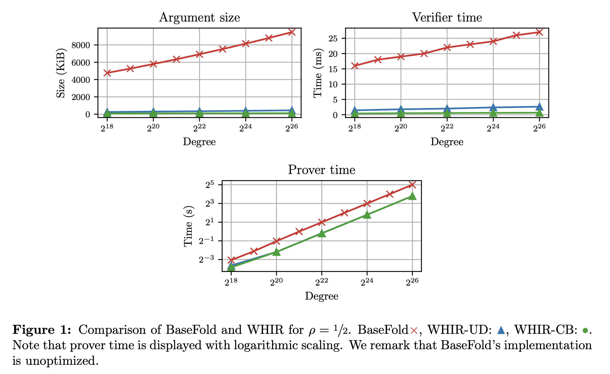
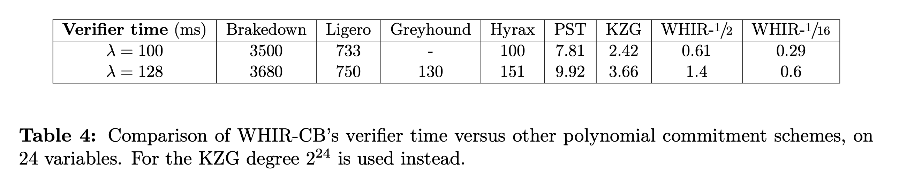
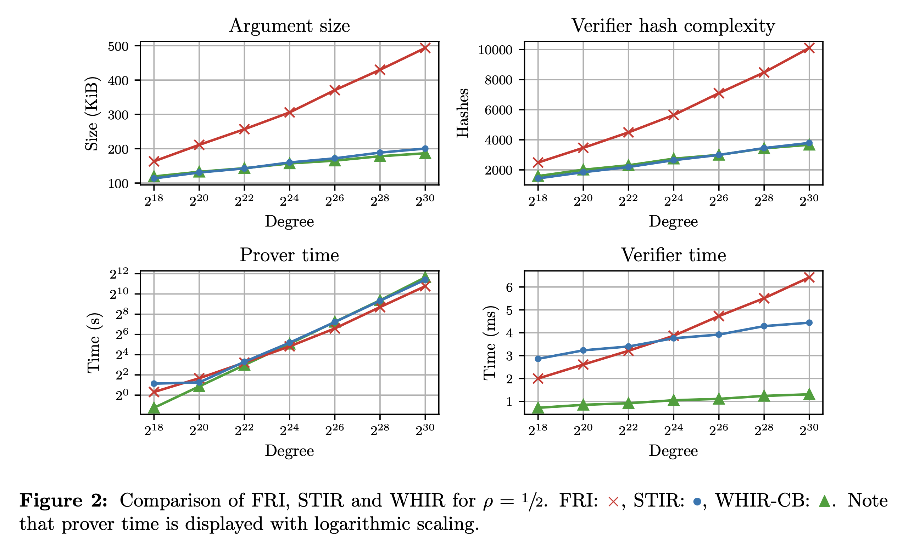

This blog-post is a short introduction to our new work: "WHIR: Reed--Solomon Proximity Testing with Super-Fast Verification". This is joint work with [Gal Arnon,](https://galarnon42.github.io/) [Alessandro Chiesa,](https://ic-people.epfl.ch/~achiesa/) and [Eylon Yogev,](https://www.eylonyogev.com/about) and the full version is [available on ePrint](https://eprint.iacr.org/2024/XXX). Code is also available at [WizardOfMenlo/whir.](https://github.com/WizardOfMenlo/whir)


# WHIR 🌪️
We present WHIR (Weights Help Improving Rate), a concretely efficient IOPP for constrained Reed--Solomon codes[^1]. 

WHIR is both an IOPP for Reed--Solomon codes and a multilinear polynomial commitment scheme (PCS), and achieves the _fastest verification_ speed of *any* such scheme, even including univariate PCS with trusted setup. 
It does so while mantaining state-of-the-art argument size and verifier hash complexity for hash-based schemes, requiring only transparent setup and guaranteeing post-quantum security.

As a multilinear and univariate PCS, WHIR achieve by far the smallest verification time across all scheme that we tested.
Taking $d = 2^{24}$ as an example:
- At the 100-bit security level, a WHIR proof verification takes between 610μs (with $\rho = 1/2$) to 290μs (with $\rho = 1/16$). This is a speedup of between **5700×-12000×** against Brakedown, **1200×- 2500×** against Ligero, **164×-345×** against Hyrax, **13×-27×** against PST and **4.0×-8.3×** against KZG.
- At the 128-bit security level, a WHIR proof verification takes between 1.4ms to 700μs achieving a speedup of between **2600×-5300×** against Brakedown, **535×-1100×** against Ligero, **93×-186×** against Greyhound, **108×-216×** against Hyrax, **7×-14×** against PST and **2.6×-5.2×** against KZG.

As an hash-based multilinear PCS, WHIR compares favourably to BaseFold in (i) argument size (ii) verifier time (iii) verifier hashes.

Taking $d = 2^{24}$ and $\rho = 1/2$ as an example, at the 100-bit security level:
- WHIR's arguments are 101 KiB vs BaseFold's 7.95 MiB (**74× better**).
- WHIR's verifier runs in 610μs vs BaseFold's 24ms (**39× better**).

As a low-degree test, WHIR achieves best-in-class verifier time, while mantaining state-of-the-art argument size and verifier hash complexity.
Taking $d = 2^{24}$ and $\rho = 1/2$ as an example, at the 128-bit security level:
- WHIR's arguments occupy 157 KiB vs STIR's 160 KiB and FRI's 306 KiB (**1.95× better**).
- WHIR's verifier perform 2.7k hashes vs STIR's 2.6k and FRI's 5.6k (**2.1× better**).
- WHIR's verifier runs in 1.0ms vs STIR's 3.8ms and FRI's 3.9ms (**3.8× better**).

---
## Applications
We present a few applications that we believe WHIR is a natural candidate for.
### On chain verification
Currently, most onchain verification is done with Groth16 over a BN254 curve. The benefits of such verification is that the proof is constant size and verification is supposed to cheap, keeping both data availability (DA) costs and compute costs low. Currently, this verification costs [~280k gas](https://sepolia.etherscan.io/tx/0x9db0680f9164e045cf1cbf6f6c3a1afff204e2dc6c5af9582fb2ba89ef3e2b12). 
We believe that, as long as DA costs are low (as they currently are), WHIR can offer significantly lower compute costs for onchain proof verification (and we are working on a Solidity verifier to confirm this thesis). 
A rough back-of-the-envelope calculation: a WHIR verifier for a polynomial of size $2^{24}$ performs between 2.2k to 1.1k hashes (depending on the initial rate, using 100-bits of security to compare with BN254). Assuming the hash used is Keccak, and that each of these hashes is for Merkle tree verification (and thus hashes together 64 bytes), each of these hashes costs 48 gas. Thus, the cost of hash-verification is between **106k gas to 53k gas**. Estimating the cost of the field operations is harder, but they tend account for a much smaller portion of the verification costs (on native experiments) compared to the hashing.

### Recursive verification
Due to the small number of hashes, WHIR's verifier (as STIR's was) is a natural candidate for recursion. Again, let's do some back-of-the-envelope calculation. At the 128-bit security level, for a computation of size $2^{28}$, starting with rate $1/2$, WHIR's recursive circuit performs $3.4$k hashes. Assuming both use Poseidon hashing and that each hash contributes ~400 R1CS constraints, the WHIR's recursive circuit size is approximately of size $2^{20}$. Then, running WHIR with even a large rate is a negligible cost (compared to the initial computation), leading to a tiny final proof. For example, running a computation of that size with rate $1/32$ gives a 64KiB proof in less than 3s (on my M1 Macbook), that verifies in less that $350µ$s while performing only 800 hashes.

### zkLogin
Various blockchains such as [Sui](https://sui.io/zklogin) and [Aptos](https://aptos.dev/en/build/guides/aptos-keyless/how-keyless-works) have new onboarding and login strategy which make heavy use of zero-knowledge proofs. Currently, taking Sui's zkLogin as an example, the final circuit is around the size of a million of constraints and is currently proven by using a Groth16 proof system. WHIR could be used instead, reducing both proving time and verification time (which now is native!).


---
# High-level overview

We first introduce constrained Reed--Solomon codes, then we describe the main protocol and sketch its complexity.

## Constrained Reed--Solomon codes
WHIR is an expressive IOPP for a generic class of codes, that we call constrained Reed--Solomon codes.
Recall that the Reed--Solomon code over field $\mathbb{F}$, domain $L \subseteq \mathbb{F}$ and rate $\rho = 2^m/|L|$ is defined as $\mathsf{RS}[\mathbb{F}, L, m] = \\{ f: L \to \mathbb{F}: \exists \hat{p} \in \mathbb{F}^{< 2^m}[X] : \hat{p}(L) = f(L)\\}$. Equivalently, one can view a univariate polynomial of degree $2^m$ as a multilinear polynomial over $m$ variables, and one can recover evaluations of the former from the evaluations of the latter on points of the form $(x, x^2, \dots, x^{2^{m-1}})$.
Thus, we rewrite $\mathsf{RS}[\mathbb{F}, L, m] = \\{ f: L \to \mathbb{F}: \exists \hat{p} \in \mathbb{F}^{< 2}[X_1, ..., X_m] \text{ s.t. } \forall x \in L \; \hat{p}(x, \dots, x^{2^{m-1}}) = f(x) \\}$.
For any codeword $f \in \mathsf{RS}[\mathbb{F}, L, m]$, we let $\hat{f}$ denote the corresponding multilinear polynomial.

Constrained Reed--Solomon codes are defined by a constraint, which consists of a weight polynomial $\hat{w}\in \mathbb{F}[Z, X_1, \dots, X_m]$ and of a target $\sigma \in \mathbb{F}$:

$$ \mathsf{CRS}[\mathbb{F}, L, m, \hat{w}, \sigma] := \\{ f \in \mathsf{RS}[\mathbb{F}, L, m] : \sum_{\mathbf{b}} \hat{w}(\hat{f}(\mathbf{b}), \mathbf{b}) \\} $$

Note, for example, that by setting $\hat{w}(Z, X_1, \dots, X_m) = Z \cdot \mathsf{eq}(\mathbf{z}, X_1, \dots, X_m)$ for some $\mathbf{z} \in \sigma$ the constrained code exactly captures Reed--Solomon codewords whose corresponding polynomial evaluates to $\sigma$ at $\mathbf{z}$.

---
## WHIR
WHIR is an IOPP of proximity for constrained Reed--Solomon codes. WHIR makes use of both the sumcheck techniques introduced in [ZFC24][^basefold] and of the rate improvement techniques in [ACFY24][^stir].

Let $k$ be a folding parameter, $\delta \in (0, 1 - \sqrt{\rho})$[^2] a proximity parameter and $t$ a repetition parameter. A WHIR iteration reduces testing that
$$ f \in \mathsf{CRS}[\mathbb{F}, L, m, \hat{w}, \sigma] $$
to testing that 
$$ g \in \mathsf{CRS}[\mathbb{F}, L^2, m - k, \hat{w}', \sigma'],$$
for related $g, \hat{w}', \sigma'$.

Further, if $f$ was $\delta$-far from the original code, then, unless with probability approximately $(1 - \delta)^t$, $g$ will be $(1 - \sqrt{\rho'})$-far from the smaller code, where $\rho' = 2^{1 - k} \cdot \rho$ is the code of this new code.

The iteration consists of the following steps:
1. **Sumcheck rounds.** The prover and the verifier engage in $k$ rounds of the sumcheck protocol for the claim
    $$ \sum_{\mathbf{b}} \hat{w}(\hat{f}(\mathbf{b}), \mathbf{b}) = \sigma $$
    where $\hat{f}$ is the multilinear polynomial associated with $f$.
    At the end of the interaction, the prover will have sent quadratic $(\hat{h}\_1, \dots, \hat{h}\_k)$ while the verifier will have sampled randomness $(\alpha_{1},\dots,\alpha_{k})\in \mathbb{F}^k$. This reduces the initial claim to the simpler claim
    $$ \sum_{\mathbf{b}} \hat{w}(\hat{f}(\alpha_1, \dots, \alpha_k, \mathbf{b}), \alpha_1, \dots, \alpha_k, \mathbf{b}) = \sigma $$
2. **Claimed codeword.** The prover sends a function $g: L^2 \to \mathbb{F}$. In the honest case, $g$ is the codeword associated to the $(m - k)$-variate multilinear polynomial $\hat{f}(\alpha_1, \dots, \alpha_k, \cdot)$.
3. **Out-of-domain sample.** The verifier samples and sets $z_0 \gets \mathbb{F}$. We let $\mathbf{z}_0 := (z_0, \dots, z_0^{2^{m-1}})$.
4. **Out-of-domain answer.** The prover replies with $y_0$. In the honest case $y_0 := \hat{g}(\mathbf{z}_0)$.
5. **Shift queries and combination randomness.** For every $i \in [t]$, the verifier samples $z_i \gets L^{2^k}$, computes $y_i := \mathsf{Fold}(f, (\alpha_1, \dots, \alpha_k))(z_i)$ by querying $f$[^3], and sets $\mathbf{z}_i := (z_i, \dots, z_i^{2^{m-1}})$. It then samples $\xi \gets \mathbb{F}$ and sends $z_1, \dots, z_t, \xi$ to the prover.
6. **Recursive claim.** Prover and verifier set:
$$ \hat{w}'(Z, \mathbf{X}) := \hat{w}(Z, \alpha_1, \dots, \alpha_k, \mathbf{X}) + Z \cdot \sum_{i = 0}^t \xi^{i + 1} \cdot \mathsf{eq}(\mathbf{X}, \mathbf{z}_i) $$
and
$$ \sigma' := \hat{h}_k(\alpha_k) + \sum\_{i = 0}^t \xi^{i + 1} y_i $$

At each iteration, the verifier performs exactly $t$ queries to the function being tested each of which reads $2^k$ field elements, performs $O(k)$ field operations to check the sumcheck claims and $O(t \cdot 2^k)$ fops to compute the folds[^4]. Additionally, in the final iteration the verifier will have to evaluate a final weight polynomial $\hat{w}$ which contains $O(\sum_i t_i)$ equality polynomials over at most $m$ variables (plus the initial weight).

The soundness analysis relies on a new property of Reed--Solomon codes, that we call **mutual correlated agreement**. This is a strenghtening of correlated agreement [BCIKS20][^proximitygaps], which we show holds in the unique decoding regime. We are confident to conjecture that it also holds in the list-decoding regime. Further, we believe that WHIR can be proven sound from weaker assumptions still. 
We refer the reader to the paper for more details.

---
## Benchmarks
We implemented WHIR in Rust, and evaluated its performance. Our code can be found at [WizardOfMenlo/whir](https://github.com/WizardOfMenlo/whir). _We thank in particular Remco Bloemen for his invaluable help in optimizing the prover performance of WHIR_.

We present some of our comparisons here, and refer the reader to Section 6 of the paper for full details.

### Comparison with BaseFold


WHIR achieves significantly smaller argument size compared to BaseFold[ZFC24][^basefold], while achieving significantly faster proving and verification. In part, this is due to WHIR having a more optimized implementation.

### Comparison with other PCSes

WHIR achieves the fastest verification time of **any** PCS know thus far. In particular, this includes schemes such as PST and KZG which rely on both a trusted setup and on pairings of elliptic curves.

## Comparision with LDTs

Finally, WHIR achieves state-of-the-art argument size, verifier hash-complexity among low-degree tests, while not compromising prover performance and achieving best-in-class verifier performance.

---
##### Citation

G. Arnon, A. Chiesa, G. Fenzi, E. Yogev. "_WHIR: Reed–Solomon Proximity Testing with Super-Fast Verification_". Cryptology ePrint Archive, Paper 2024/XXX. Available at: https://ia.cr/2024/XXX.

```BibTeX
@misc{ArnonCFY,
	author       = {Gal Arnon and Alessandro Chiesa and Giacomo Fenzi and Eylon Yogev},
	title        = {WHIR: Reed–Solomon Proximity Testing with Super-Fast Verification},
	howpublished = {Cryptology ePrint Archive, Paper 2024/XXX},
	year         = {2024},
	note         = {\url{https://eprint.iacr.org/2024/XXX}},
	url          = {https://eprint.iacr.org/2024/XXX}
}
```

---
##### Related material
[^1]: constrained Reed--Solomon codes are a generalization of Reed--Solomon codes which we introduce later. 
[^2]: here and in other places, $1 - \sqrt{\rho}$ can be improved to $1 - \rho$ via an appropriate conjecture on list-decoding of Reed--Solomon codes up to capacity. 
[^3]: the folding herein is the same as in FRI [BBHR18][^fri] and STIR [ACFY24][^stir], and we assume familiarity with it.
[^4]: traditionally, this step would require $O(t \cdot k \cdot 2^k)$ fops, but we present an optimization to avoid the quasilinear cost in $k$, see paper for details.
[^fri]: [BBHR18] Eli Ben-Sasson, Iddo Bentov, Yinon Horesh, and Michael Riabzev. “Fast Reed–Solomon Interactive Oracle Proofs of Proximity”. In: Proceedings of the 45th International Colloquium on Automata, Languages and Programming. ICALP ’18. 2018,
[^proximitygaps]: [BCIKS20] Eli Ben-Sasson, Dan Carmon, Yuval Ishai, Swastik Kopparty, and Shubhangi Saraf. “Proximity Gaps for Reed–Solomon Codes”. In: Proceedings of the 61st Annual IEEE Symposium on Foundations of Computer Science. FOCS ’20. 2020.
[^deepfri]: [BGKS20] Eli Ben-Sasson, Lior Goldberg, Swastik Kopparty, and Shubhangi Saraf. “DEEP-FRI: Sampling Outside the Box Improves Soundness”. In: Proceedings of the 11th Innovations in Theoretical Computer Science Conference. ITCS ’20.
[^stir]: [ACFY24] Gal Arnon, Alessandro Chiesa, Giacomo Fenzi, Eylon Yogev. “STIR: Reed--Solomon Proximity Testing with Fewer Queries”. In: Proceedings of the 44th Annual International Cryptology Conference. CRYPTO ’24. CRYPTO ’24.
[^basefold]: [ZCF24] Hadas Zeilberger, Binyi Chen, and Ben Fisch. “BaseFold: Efficient Field-Agnostic Poly- nomial Commitment Schemes from Foldable Codes”. In: Proceedings of the 44th Annual International Cryptology Conference. CRYPTO ’24
